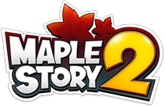

  

  
  

A curated list of awesome MapleStory 2 emulators, libraries and software.

<!-- markdown-toc start - Don't edit this section. Run M-x markdown-toc-refresh-toc -->
**Table of Contents**

- [Emulators](#emulators)
- [Libraries](#libraries)
- [Software](#software)
- [Other Awesome Lists](#other-awesome-lists)
- [License](#license)

<!-- markdown-toc end -->

## Emulators

- [MapleServer2](https://github.com/AlanMorel/MapleServer2) - MapleStory 2 Emulator
- [Maple2](https://github.com/MS2Community/Maple2) - Server emulator for MapleStory2.

## Libraries

- [MS2Lib](https://github.com/Miyuyami/MS2Lib) - A library for manipulating MapleStory 2 game archives.
- [Maple2.File](https://github.com/kOchirasu/Maple2.File) - MapleStory2 m2d file parsing
- [MapleStory2-XML](https://github.com/MS2Community/MapleStory2-XML) - A modified MapleStory 2 XML to fill in missing pieces

## Software

- [MapleShark2](https://github.com/kOchirasu/MapleShark2) - MapleShark2 is a MapleStory2 sniffer that works with SharpPcap. Sniff dem packetzz!
- [Maple2.PacketLib](https://github.com/kOchirasu/Maple2.PacketLib) - Packet library for MapleStory2
- [Orion2-Repacker](https://github.com/EricSoftTM/Orion2-Repacker) - A MapleStory2 Repacker
- [MS2Tools](https://github.com/Miyuyami/MS2Tools) - Tools that use MS2Lib.

## Other Awesome Lists

A curated list of awesome lists can be found at [awesome.re](https://github.com/sindresorhus/awesome#readme).

## License

To the extent possible under law, [MapleStoryUnity](https://github.com/MapleStoryUnity)
has waived all copyright and related or neighboring rights to this work.
